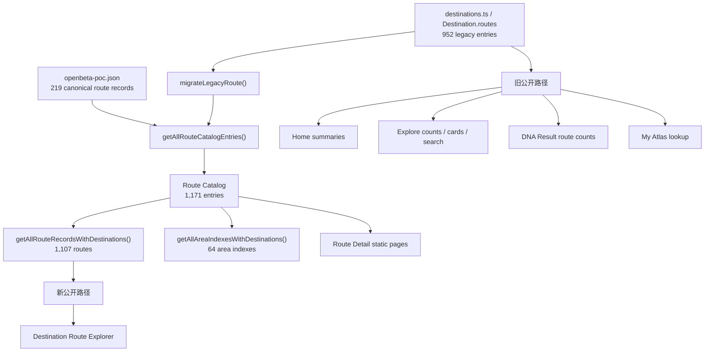

# Route Coverage 2.0 - Production Polish Audit

**中文名称：** Route Coverage 2.0 - 生产环境整理审计
**审计日期：** 2026-07-15
**阶段：** PP-0（只读审计）
**结论状态：** 等待产品确认后再进入 PP-1

## 范围与方法

本报告只审计现有 Route Coverage 2.0 的生产完成度，不增加线路、不迁移数据库、不调整 Climbing DNA 评分，也不修改生产代码。

检查范围：

- 标准化 Route Catalog、旧 `Destination.routes` 和 OpenBeta POC 导入快照。
- 首页、Explore、Destination、Route Explorer、Route Detail、Climbing DNA Result 和 My Atlas 的数据路径。
- 路线校验、Grade 识别、筛选、排序、公开状态、来源信息和中英文文案。
- 仓库内 `climbatlas-copy-review`，使用 audit-only 模式。

已运行：

- `npm.cmd run routes:validate-schema`：952 个旧条目、219 个导入条目、1,107 条 Route Record、64 个 Area Index；0 error，219 warning。
- `npm.cmd run routes:validate`：1,171 个 Catalog Entry；0 error，1,590 warning。
- `npm.cmd run dna:validate`：10 题、6 种人格、20 个目的地画像通过验证。
- 直接调用当前 `buildRouteAuditReport()` 完成实时只读统计。

仓库原有 audit 命令尝试改写 `outputs/route-coverage-audit.json` 时被当前桌面沙箱阻止。这是执行环境写权限，不是产品代码错误，也不影响本报告中的实时统计。

## 执行摘要

Route Coverage 2.0 已经有可用的标准化数据层，但公开界面仍混用旧数据和新 Catalog。当前最重要的问题不是继续增加线路，而是把公开规则收口。

最高优先级结论：

1. **路线数量存在两套口径。** 旧数组是 952 个条目；标准化 Catalog 是 1,171 个条目，其中 1,107 条线路、64 个区域索引。
2. **首页显示虚构的个性化比例。** 三张目的地卡固定显示 `94% / 89% / 86% match`，没有读取用户 DNA。
3. **内部编辑状态直接公开。** Route Explorer 显示 candidate、reviewed、imported、完整度和 link upgrade 状态。
4. **当前没有正式 ClimbAtlas Pick。** 800 个 Pick 全部是 `needs-review`；reviewed/published Pick 为 0。
5. **Grade 筛选不足以处理当前数据。** 498 条 Grade 带 `metadata` marker，73 条 system unknown，180 条 difficulty unknown。
6. **Route Detail 有大量空模块。** 800 个 Highlight 中 791 个无图片，Community 对全部条目都是 Coming Soon。
7. **新旧数据路径造成真实功能缺口。** 219 条导入 Route 无法被 Explore 全局搜索，保存后也无法在 My Atlas 中解析。

建议先完成 PP-1 到 PP-4，再开始大范围文案清理。

---

# A. 当前实现概况

## A1. Route Count 数据来源图



**当前标准化权威来源：** `getAllRouteCatalogEntries()`，由 legacy migration 与 OpenBeta snapshot 合并。

**关键缺口：** 没有公共可见性 selector，也没有独立 visibility 字段。公开组件可绕过 Catalog 直接读取旧数组。

## A2. 建议统一的公开计数定义

| 名称 | 建议定义 | 当前值 | 是否公开 |
| --- | --- | ---: | --- |
| Total Catalog Entries | Route + Area Index 的内部目录总数 | 1,171 | 否 |
| Total Indexed Routes | `kind === "route"` 的标准化记录 | 1,107 | 可公开，标为 routes indexed |
| Publicly Visible Routes | 通过阻断校验、非隐藏的 Route | 当前未定义；暂估 1,107 | 必须先定义规则 |
| ClimbAtlas Picks | `tier=pick && status=published` | 0 | 0 时不显示 |
| Reviewed Editorial Routes | reviewed 或 published 的 Pick | 0 | 内部指标 |
| Filtered Route Results | Public Routes 经当前筛选后的结果 | 动态 | 公开 |
| Area Indexes | `kind === "area-index"` | 64 | 独立呈现，不计作 Route |

建议 PP-1 建立共享函数：

- `getPublicRouteRecords()`
- `getPublicRoutesForDestination(slug)`
- `getDestinationRouteCount(slug)`
- `getPublishedPicksForDestination(slug)`
- `getFilteredRouteCount(...)`

## A3. 各公开页面当前来源

| 页面/功能 | 当前来源 | 问题 |
| --- | --- | --- |
| Home featured summaries | `destination.routes.length` | 旧口径；routeCount prop 当前未显示但仍错误 |
| Explore 总路线数 | 旧数组求和 | 显示 952 |
| Explore 目的地排序和 badge | 旧数组长度 | 把 Area Index 算作 Route，忽略导入 Route |
| Explore 全局搜索 | 旧 `destination.routes` | 搜到 Area Index，搜不到 219 条导入 Route |
| DNA Result 卡片 | 旧数组长度 | 与 Destination Route Explorer 不一致 |
| Destination Route Explorer | 标准化 Route Record | 使用 1,107 Route，不含 Area Index；方向正确 |
| Route Detail | 全部 Catalog Entry | 连 64 个 Area Index 也生成 `/routes/...` |
| My Atlas | 旧 route lookup | 导入 Route 保存后无法解析显示 |

## A4. 20 个目的地计数对照

`Legacy` 是部分公开页面当前使用的数字；`Standard Routes` 是 Route Explorer 的线路数。

| Destination | Legacy | Standard Routes | Area Index | Delta |
| --- | ---: | ---: | ---: | ---: |
| Yosemite | 53 | 128 | 0 | +75 |
| Red River Gorge | 70 | 140 | 5 | +70 |
| Joshua Tree | 46 | 42 | 4 | -4 |
| Smith Rock | 44 | 109 | 4 | +65 |
| Squamish | 66 | 64 | 2 | -2 |
| El Potrero Chico | 43 | 40 | 3 | -3 |
| Fontainebleau | 57 | 56 | 1 | -1 |
| Chamonix | 44 | 40 | 4 | -4 |
| Ceuse | 46 | 40 | 6 | -6 |
| Kalymnos | 54 | 48 | 6 | -6 |
| Dolomites | 44 | 40 | 4 | -4 |
| Frankenjura | 45 | 40 | 5 | -5 |
| Siurana | 44 | 40 | 4 | -4 |
| Margalef | 44 | 40 | 4 | -4 |
| Yangshuo | 43 | 40 | 3 | -3 |
| Liming | 40 | 40 | 0 | 0 |
| Long Dong | 43 | 40 | 3 | -3 |
| Railay / Tonsai | 43 | 40 | 3 | -3 |
| Grampians | 43 | 40 | 3 | -3 |
| Rocklands | 40 | 40 | 0 | 0 |
| **Total** | **952** | **1,107** | **64** | **+155** |

Yosemite、RRG、Smith Rock 的正差来自 219 条导入 Route；多数负差来自旧数组把 Area Index 计作 Route。

---

# B. 已确认的问题

## B1. P0 - 缺少公共路线选择器

**位置：** `src/lib/routes.ts:39-119`、`src/app/page.tsx:23-35`、`ExploreClient.tsx:50-55`、Destination page。

Catalog 有 module cache，但没有 public selector。公开页面可以直接绕过 Catalog。

**修复方向：** PP-1 先定义公开 Route、Area Index 和 Published Pick，再迁移所有消费者。不要在组件中分别计算。

## B2. P0 - 首页固定显示假的 DNA Match

**位置：** `src/components/HomeClient.tsx:111,184-194`。

`matchScores = [94, 89, 86]` 不读取 Local Storage，也不验证 DNA Profile。

**修复方向：** 无 Profile 时显示目的地特征和 DNA CTA；有效 Profile 存在时复用正式 destination match。

## B3. P0 - 内部编辑状态控制公开排序

**位置：** `RouteIndex.tsx:73-82,189-216,251-289,351-390,451-490`。

数据事实：

- `pick:needs-review`：800
- `index:needs-review`：88
- `index:draft`：219
- reviewed/published Pick：0

未审核 Pick Candidate 在默认排序中领先普通 Route Index，且界面直接显示编辑/导入统计。

**修复方向：** 只有 published Pick 可显示 Pick badge；没有 Published Pick 时采用稳定的代表性排序。

## B4. P0 - Grade 原始值与筛选值没有分层

**位置：** `migrate-legacy-route.ts`、`route-explorer.ts`、`RouteIndex.tsx`。

已确认：

- 498 条 `grade.original` 含迁移 marker `metadata`。
- 73 条 Grade System 为 unknown。
- 180 条 Difficulty Band 为 unknown。
- `normalizedDifficulty` 类型存在，但没有形成统一数据。
- `5.9-5.12` 按 5.9 分组，`6a-7c` 按 6a 分组，`V6-V15` 按 V6 排序。
- Mixed、Alpine、UIAA/British 不进入当前排序。

**修复方向：** 保留 original；建立 parser result，拆分 primary free grade、range、aid、commitment、filter band 和 sort value。

## B5. P0 - 迁移占位词仍会出现在详情页

Route Explorer mapper 会临时删除 `metadata`，但 `RouteMetadataCard` 和 `RouteRecordCard` 可直接显示原始值。

**修复方向：** 不覆盖来源原文；把 migration marker 从事实字段拆出，通过 display selector 生成公开值。

## B6. P1 - 导入路线无法被搜索和个人路线本完整使用

**位置：** `ExploreClient.tsx:93-105`、`MyAtlasClient.tsx:81-127`。

两处只认识 legacy routes。219 条导入 Route 存在于 Explorer/Detail，却不能被 Explore 搜索；用户保存后，My Atlas lookup 找不到并静默丢弃。

**修复方向：** 搜索与个人记录统一使用公共 Route Summary。

## B7. P1 - Area Index 被当作 Route

64 个 Area Index 被 legacy 搜索返回，并静态生成到 `/routes/...`；通用 Route hero 和保存按钮仍出现。

**修复方向：** 使用独立 Area/Sector 入口，或回到 Destination；不进入 Route count/search/save。

## B8. P1 - Route Detail 对数据类型适配不足

通用 hero 对 metadata/imported/area index 都声称可判断“风格、练习方向、是否适合今天”，但这些内容可能不存在。

**修复方向：** 根据 entry kind 与内容 capability 切换 hero 和模块。

## B9. P1 - 全站编辑文案未经过发布门槛

800 条 Highlight 全部是 `needs-review`，但 summary、style、bestFor 和 tips 仍公开。Migration 只确认存在 source record，没有完成 field-level editorial review。

**修复方向：** 未审核编辑内容保留在数据层，公开先展示结构化事实；人工审核后再发布。

## B10. P2 - 隐藏旧布局仍在生产源码

**位置：** Destination page `:56-109`、Route Detail `:79-98`。

旧 hero/navigation 通过 `className="hidden"` 保留。通常不会进入无障碍树，但重复源码和图片分支仍参与构建。

**修复方向：** PP-6 删除确认废弃的 JSX，不用 CSS 作为永久功能开关。

---

# C. 需要进一步检查才能确认的问题

1. **Publicly Visible Routes 规则。** 需要产品确认：source-backed 且无 blocking error 是否都公开，还是需要显式 denylist。
2. **两个低置信重复候选。** Railay 的 Wee's Present Wall、Yosemite 的 Steck-Salathe 需要人工核对。
3. **外链实时有效性。** 本轮未运行网络型全站 link verifier；PP-7 应验证 404/redirect。
4. **用户列出的异常 Grade。** 当前 Catalog 没有精确匹配 `5.8-5.8`、`5.8+5.9-`、`5.9+5.10-`，但范围解析根因仍存在。需检查旧产物或历史导入。
5. **移动端筛选。** 所有筛选器连续堆叠，没有 mobile drawer；需浏览器测试。
6. **键盘焦点。** Filter controls 有 focus 样式，主要链接/卡片没有统一 `:focus-visible`；需视觉确认。
7. **首页 DNA 状态恢复。** 需覆盖无 Storage、损坏 Storage、完整 Profile、刷新和语言切换。
8. **客户端 bundle。** ExploreClient 与 MyAtlasClient 直接 import 大型 `destinations.ts`；需 build/analyzer 后决定是否拆分。

---

# D. 所有公开 Percentage / Score 清单

| 位置 | 当前分数 | 来源 | 判断 | 建议 |
| --- | --- | --- | --- | --- |
| Home cards | 固定 94/89/86% match | 硬编码 | **不合格** | 无 Profile 不显示；有 Profile 真实计算 |
| DNA Result profile bars | 六维 0-100 | 10 题归一化 | 有效但需命名 | 标为 DNA profile score |
| DNA Result destinations | Match % | 正式 destination match | 有效 | 统一为 DNA preference match |
| DestinationDnaMatch | Match % | 完整 Local Storage Profile | 有效 | 保留限制说明 |
| Route Explorer card | DNA Match % | 完整 Profile + inferred route DNA | 有条件有效 | 标明偏好匹配与推断来源 |
| Route Detail DNA | `% match` | 完整 Profile + snapshot | 算法有效，标签模糊 | 改为 preference match |
| Route Explorer card | completeness % | 字段存在性加权 | **内部 QA 误公开** | 删除公开数字 |
| Route Explorer sort | Most complete | completeness score | **内部 QA 误公开** | 删除公开排序 |
| DNA quiz progress | 题目进度 | 当前题/总题 | 有效 | 保留并补语义化 aria |
| 旧 RouteFinder | 旧问卷 match | 旧组件 | 当前未挂载主页面 | 确认废弃后隔离/删除 |

结论：必须移除 Home 固定 Match 和 Route Completeness。其余统一叫“DNA 偏好匹配”，并区分用户 Profile、目的地 Profile、推断 Route DNA 和内部 confidence。

---

# E. 内部状态暴露清单

| 公开位置 | 当前暴露 | 建议 |
| --- | --- | --- |
| Route Explorer header | pick candidates / reviewed picks / imported indexes | 只显示公开结果数 |
| Route Explorer filter | Content tier / Picks and candidates / Route index | 移除内部 tier |
| Route Explorer sort | Most complete | 删除 |
| Route Explorer card | completeness / pick candidate / route index | 只显示事实、Published Pick、DNA Match |
| Route Explorer card | needs upgrade / no outbound link | 无链接时隐藏 CTA |
| RouteRecordCard | raw `verification.status` | 简化为“有来源支持” |
| RouteRecordCard | provider / verifiedFields / license not stated | 保留署名、许可、URL、检查日期；内部字段折叠 |
| RouteMetadataCard | metadata / Needs upgrade / not ready / TBD | 未就绪条目不公开；缺字段自然省略 |
| RouteMetadataCard | trust level / source type / verifies | 保留内部 audit |
| RouteHighlightCard | single-source / trust / needs upgrade | 用简明来源透明度替代 |
| Route Detail DNA | origin + raw confidence | 写自然的推断说明，不显示 enum |
| Destination empty state | source-backed routes | 改成用户语言 |

底层字段全部保留。PP-2 只改变 selector 和 render。

---

# F. Grade / Filter 问题报告

## F1. 数据概况

| 指标 | 数量 |
| --- | ---: |
| Route Record | 1,107 |
| YDS | 624 |
| French | 212 |
| Font | 75 |
| Mixed | 75 |
| Unknown | 73 |
| Alpine | 29 |
| V-scale | 16 |
| Aid | 3 |
| 含 `metadata` marker | 498 |
| Difficulty unknown | 180 |

Difficulty Band 当前分布：Intro 129、Intermediate 316、Advanced 299、Elite 183、Unknown 180。

## F2. 根因

1. Grade System detection 是正则命中，不是结构化 parser。
2. UIAA 只识别字面 `UIAA`。Dolomites 36/40 system unknown，40/40 difficulty unknown。
3. Australian detection 只接受 Grampians 纯数字。Grampians 22/40 system unknown，32/40 difficulty unknown。
4. Mixed 不解析 primary free grade。
5. Range 只取下限。
6. Exact Grade 直接列原始字符串：Yosemite 36 个选项、Chamonix 32、Grampians 28。
7. Difficulty Band 总显示全部五个选项，即使目的地没有对应线路。
8. Sector filter 总是显示；只有 Style 会在空时隐藏。

## F3. 建议模型

```ts
type ParsedRouteGrade = {
  original: string;
  detectedSystems: GradeSystem[];
  primarySystem?: GradeSystem;
  primaryDisplay?: string;
  rangeMin?: number;
  rangeMax?: number;
  sortValue?: number;
  filterBand?: "intro" | "moderate" | "advanced" | "expert";
  aidGrade?: string;
  commitmentGrade?: string;
  parseStatus: "parsed" | "partial" | "unparsed";
};
```

原则：

- `grade.original` 永远保留。
- Exact Grade 只来自目的地主体系的可比较值。
- Mixed/Aid/Commitment 放进 Advanced Details。
- Range 以 overlap/包含关系筛选。
- 跨系统只写 `Approximate equivalent / 大致对应难度`。

## F4. 回归样本

`5.10a`、`5.10a/b`、`5.9+`、`5.9-5.12`、`V7`、`V6-V15`、`6b+`、`6a-7c`、`VII`、`V/VI- with VI+ step`、`VI 5.11 A2`、`VI 5.13b/c free / C2 aid`、`33 / 5.14b`、`AD / ridge` 和无法解析文本。

---

# G. 旧产品文案与术语

## G1. Destination Mini Quiz 遗留

| 位置 | 当前文案 | 建议 |
| --- | --- | --- |
| `ExploreClient.tsx:159-160` | route directory and quiz / 路线目录和小测试 | 改为 DNA Match + Route Explorer |
| `FeedbackClient.tsx:35,313` | Route Finder / 路线小测试 | 决定是否保留历史反馈项 |
| `uiText.ts:202` | 路线小测试 | 旧组件未挂载；确认后归档 |
| `ExplorerBoard.tsx` + `RouteFinder.tsx` | 旧问卷 | 当前无 app page 引用 |
| `localizedContent.ts:571` | a clear little test | 是线路比喻，不机械替换，但需文案审计 |

推荐主句：

- EN: `Once you enter a destination, DNA Match and Route Explorer help you find climbs that fit your style.`
- ZH: `进入目的地后，通过 DNA 匹配和线路探索器，找到更适合你的线路与攀岩体验。`

## G2. Approved Terminology 提案

| 内部/原始词 | 公开英文 | 公开中文 | 规则 |
| --- | --- | --- | --- |
| route / climb / line | Route | 线路 | UI 名词统一 |
| index tier | Route | 线路 | 不公开 tier |
| area-index | Area / Sector | 区域 / 岩区 | 不作为线路 |
| published pick | ClimbAtlas Pick | ClimbAtlas 精选 | 只给 published |
| pick candidate | 不公开 | 不公开 | 内部保留 |
| source-backed | Source-backed | 有来源支持 | 不显示 raw enum |
| verified | Verified fact | 已核验事实 | 不等同 source-backed |
| DNA Match | DNA preference match | DNA 偏好匹配 | 不代表能力/安全 |
| recommendation | Recommended for your DNA | 根据你的 DNA 推荐 | 仅有效 Profile |
| completeness | 不公开 | 不公开 | 内部 QA |

PP-5 应将此表提炼为 `docs/content/approved-terminology.md`。

## G3. 线路卡片文案审计（audit-only）

### Finding 1

- **Location:** `destinations.ts:1501`，Astroman。
- **Current copy:** `history loud and their systems quiet`。
- **Issue category:** excessive metaphor。
- **Why:** 记忆点高于路线类型、适合对象和取舍。
- **Suggested revision:** 核实事实后，直接说明线路要求和适合的队伍经验。
- **Confidence:** high。
- **Requires factual verification:** yes。

### Finding 2

- **Location:** `destinations.ts:3594`，Commitment。
- **Current copy:** `before the day grows teeth`。
- **Issue category:** generic AI phrasing。
- **Why:** 拟人化没有增加路线选择价值。
- **Suggested revision:** 保留“较短多段、练习组织与配合”，删除比喻。
- **Confidence:** high。
- **Requires factual verification:** yes。

### Finding 3

- **Location:** `localizedContent.ts` 与 `destinations.ts`。
- **Current copy:** `Choose it when...` / `Pick it when...`。
- **Issue category:** repeated sentence structure。
- **Why:** 两文件至少出现 245 次 Choose、278 次 Pick，目录明显模板化。
- **Suggested revision:** 只对审核后 Picks 分批改写，轮换 fit、trade-off、best-for 和 comparison。
- **Confidence:** high。
- **Requires factual verification:** no（新增具体特征时需要）。

### Finding 4

- **Location:** 多个 summary/bestFor。
- **Current copy:** `This card is for...` 和大量 `card` 自指。
- **Issue category:** unclear user value。
- **Why:** `destinations.ts` 中 card 约 506 次，描述 UI 而不是线路。
- **Suggested revision:** 直接写线路类型、关注理由、适合对象、考虑因素。
- **Confidence:** high。
- **Requires factual verification:** no。

### Finding 5

- **Location:** 中文 route copy。
- **Current copy:** `session 控制`、`route menu` 等。
- **Issue category:** English/Chinese mismatch。
- **Why:** 中文不自然，术语不统一。
- **Suggested revision:** 使用“尝试节奏/单次训练控制”“线路选择”。
- **Confidence:** high。
- **Requires factual verification:** no。

### Finding 6

- **Location:** 800 条 needs-review Highlight。
- **Current copy:** movement、history、classic、friendly、technical 等判断。
- **Issue category:** unsupported factual claim。
- **Why:** source record 不等于 field-level editorial verification。
- **Suggested revision:** 未审核介绍先不公开，事实审核后逐条发布。
- **Confidence:** high。
- **Requires factual verification:** yes。

### Finding 7

- **Location:** Destination intros。
- **Current copy:** `a climbing day that listens to the coast`、`routes ... start counting`。
- **Issue category:** excessive metaphor。
- **Why:** 氛围压过适合对象与真实取舍。
- **Suggested revision:** 每段最多一个形象表达，再补具体选择信息。
- **Confidence:** medium。
- **Requires factual verification:** yes。

### Finding 8

- **Location:** UTF-8 扫描的 production TS/TSX 与 README。
- **Current copy:** 未找到 replacement character 或已知 mojibake 序列。
- **Issue category:** English/Chinese mismatch。
- **Why:** 本轮不能沿用旧结论声称当前源码仍乱码。
- **Suggested revision:** PP-5 保留编码扫描，不做猜测式修复。
- **Confidence:** medium。
- **Requires factual verification:** no。

---

# H. Route Detail 空内容报告

## H1. 量化结果

| 项目 | 数量 | 说明 |
| --- | ---: | --- |
| Legacy Highlight | 800 | 全部 needs-review |
| 无图片 | 791 | 98.9%，Photos Tab 仍固定显示 |
| 无 Historical Note | 780 | 97.5% |
| 无 Notable Ascents | 796 | 99.5% |
| 无 Story 且无 External Link | 214 | Story/Links 仍显示 |
| 无 External Resource | 214 | Hero 仍可能承诺外部资源 |
| Practice 为空 | 0 | 当前最完整模块 |
| Community | 800 | 全部 Coming Soon |
| 无显式 Route DNA Profile | 1,107 | 全部使用 inferred snapshot |

## H2. 已确认问题

1. Highlight 的五个 Tab 是固定数组，不按内容生成。
2. 791 条线路的 Photos 只有 `photos needed`。
3. Community 全部是未来占位。
4. 214 条 Story 完全没有内容。
5. Source 区公开 trust、type、verified fields、raw verification。
6. Metadata card 公开 `TBD`、`metadata-only`、`not ready for publication`。
7. Generic hero 对 metadata/area index 作出不成立的内容承诺。
8. Route DNA 仅在完整用户 Profile 后显示，这一点正确；但所有 Route DNA 都是推断，应使用自然限制说明，不显示内部 confidence。

## H3. 建议信息层级

1. Route Name
2. Original Grade
3. Climbing Type
4. Destination / Sector
5. Length / Pitches（存在时）
6. ClimbAtlas Pick（仅 published）
7. 已审核编辑介绍（存在时）
8. DNA Preference Match（条件满足时）
9. Route Characteristics
10. Things to Consider
11. Source-backed / Last checked
12. External Route Page

模块应由 capability/content selector 决定。

---

# I. Route Explorer、无障碍与性能

## I1. Route Explorer

已有优点：

- Result Count 实时更新。
- 有 Clear Filters。
- DNA sort 只在有效 Profile 时显示。
- Style filter 空时隐藏。
- Search/Select 有 label 与 aria-label。

需修复：

- 移除内部 tier、completeness 和 maintenance badge。
- Sector/Difficulty/Exact Grade 只在有真实选项时渲染。
- Exact Grade 使用目的地主 Grade System。
- Empty State 增加扩大难度/清除部分筛选的解释。
- 手机端使用可收起筛选区或 drawer。
- 没有 Published Pick 时，不把 Candidate 当默认推荐。

## I2. 无障碍

已确认筛选有 label，DNA 数值有文字，卡片链接包含路线名。

待 PP-6/PP-7 验证：

- 主要链接、卡片、按钮的 `:focus-visible`。
- 筛选结果更新是否需要 `aria-live`。
- Mobile drawer 焦点锁定、Escape 与返回焦点。
- Quiz progress 使用 progressbar 语义。
- 删除隐藏旧 JSX。

## I3. 性能

正面：

- Catalog 有 module cache。
- Destination 传给 RouteIndex 的是 summary item。
- Home server page 裁剪了 map data。

风险：

- ExploreClient 作为 client component 直接 import 完整 `destinations.ts`。
- MyAtlasClient 在客户端构建全部 legacy lookup。
- Destination build 对每页从全 Catalog filter。
- Grade 在 summary 转换时重复正则解析。

PP-4 可以预计算或缓存 Grade；无需新增框架。

---

# J. 涉及文件

## PP-1 数据一致性

- `src/lib/routes.ts`
- `src/app/page.tsx`
- `src/app/climbing-dna/result/page.tsx`
- `src/components/ExploreClient.tsx`
- `src/components/MyAtlasClient.tsx`
- `src/app/destinations/[slug]/page.tsx`
- `src/app/destinations/[slug]/routes/[routeId]/page.tsx`
- 建议新增 `src/lib/routes/public-routes.ts` 与 tests

## PP-2 公开/内部状态

- `src/components/RouteIndex.tsx`
- `src/components/RouteRecordCard.tsx`
- `src/components/RouteMetadataCard.tsx`
- `src/components/RouteHighlightCard.tsx`
- `src/types/route.ts`
- `src/lib/routes/migrate-legacy-route.ts`

## PP-3 Percentage / DNA

- `src/components/HomeClient.tsx`
- `src/components/DestinationDnaMatch.tsx`
- `src/components/ClimbingDnaResult.tsx`
- `src/components/RouteDnaMatchPanel.tsx`
- `src/components/RouteIndex.tsx`
- `src/lib/climbingDna.ts`
- `src/lib/climbingDnaStorage.ts`

## PP-4 Grade / Filter

- `src/types/route.ts`
- `src/types/route-explorer.ts`
- `src/lib/routes/migrate-legacy-route.ts`
- `src/lib/routes/route-explorer.ts`
- `src/components/RouteIndex.tsx`
- `src/lib/routes/validate-route.ts`
- Grade parser tests

## PP-5 文案 / 术语

- `src/components/ExploreClient.tsx`
- `src/components/FeedbackClient.tsx`
- `src/lib/uiText.ts`
- `src/data/localizedContent.ts`
- `src/data/destinations.ts`
- `docs/content/*`
- 建议新增 `docs/content/approved-terminology.md`

## PP-6 Detail / Explorer

- 两个 Destination/Route page
- 三个 Route Card
- `src/components/RouteIndex.tsx`
- `src/app/globals.css`

## PP-7 验证

- `scripts/routes/*`
- `scripts/validate-route-schema.mjs`
- `scripts/verify-route-links.mjs`
- tests 与 `package.json`

---

# K. 建议修复方式与前后体验

| 场景 | 修改前 | 修改后 |
| --- | --- | --- |
| 首页新用户 | 无依据 94% Match | 真实目的地特征 + DNA CTA |
| 首页已有 DNA | 固定分数 | 用户自己的真实匹配 |
| Explore 总数 | 952，混入 Area Index，缺导入 Route | 统一公开 Route 数量 |
| Destination 卡 vs Explorer | 数量可能差 75 条以上 | 同一 selector、同一含义 |
| Explorer header | 候选/审核/导入统计 | 路线结果与个人状态 |
| Route card | 完整度、候选、待升级 | Grade、类型、区域、Published Pick、DNA Match |
| Grade filter | 混合原始字符串列表 | 主体系 + 难度范围；复杂 Grade 留详情 |
| Route Detail | 五个固定 Tab | 只显示有真实内容的模块 |
| Sources | 内部检查器 | 简明来源、署名、许可、检查日期 |
| My Atlas | 导入 Route 可能消失 | 所有公共 Route 稳定展示 |

---

# L. 风险

1. 不能直接按 editorial status 隐藏所有数据，否则公开路线几乎清空。Route 可见性与 Pick 发布必须分开。
2. Explore 公开数字会从 952 变为约 1,107，需要标明 `routes indexed`。
3. 自动删除 `metadata` 可能破坏 original；必须拆字段。
4. Grade 转换不能制造虚假精确度；允许 partial/unparsed。
5. 大规模自动文案改写有事实风险；先建立发布门槛。
6. 公共 selector 加入 dedupe/visibility 后可能改变 URL；旧 URL 应 alias/redirect。
7. 删除空 Tab 风险较低，但需回归 keyboard/mobile。

---

# M. 测试计划

## 自动检查

1. `npm.cmd run routes:validate-schema`
2. `npm.cmd run routes:validate`
3. `npm.cmd run routes:audit`
4. `npm.cmd run dna:validate`
5. `npm.cmd run routes:dna-validate`
6. `npm.cmd run typecheck`
7. `npm.cmd run build`

`typecheck` 与 `build` 顺序执行，不并行。

## 新增回归测试

- Public selector：Route/Area Index 分离、visibility、Published Pick gate。
- Count parity：Home/Explore/DNA/Destination/Explorer 相同。
- Search：导入 Route 可搜，Area Index 不伪装 Route。
- My Atlas：legacy/imported 都可解析；Area Index 不可保存。
- Home DNA：无 Profile、损坏 Storage、完整 Profile、刷新、语言。
- Grade parser：F4 所有样本；original 永不变化。
- Filter：多体系、range、mixed、unknown、空 option 自动隐藏。
- Route Detail：无内容时不显示 Tab。

## 手动矩阵

- 无 DNA / 有 DNA。
- English / 中文。
- Desktop / mobile / keyboard only。
- Yosemite、Dolomites、Grampians、Fontainebleau、Kalymnos、Rocklands。
- 数据多/少的 destination。
- Published Pick、needs-review Highlight、imported Route、metadata Route、Area Index。
- 有/无图片、外链、编辑内容。

---

# N. 推荐实施顺序

## PP-1 - 数据一致性

1. 定义 Public Route 与 Pick 规则。
2. 建 shared selector 与 summary model。
3. 迁移 Home、Explore、DNA Result、Destination、Search、My Atlas。
4. Area Index 从 count/search/save 分离。
5. 先加 count parity tests，再改 UI。

## PP-2 - 公开/内部信息分离

1. 移除公开 QA counters、tier、completeness、maintenance labels。
2. 建 Published Pick gate。
3. 简化公开来源状态。

## PP-3 - Percentage / Score

1. 删除 Home fixed scores。
2. 接入真实 DNA Profile。
3. 删除公开 completeness。
4. 统一 DNA preference match。
5. 简化 inferred DNA disclosure。

## PP-4 - Grade / Filter

1. 建 parser 与 tests。
2. 拆 original/normalized/filter/sort。
3. 迁移 Explorer filter。
4. 修复 UIAA/Australian/Mixed/Range。
5. 更新 validation，不改来源原文。

## PP-5 - 文案 / 术语

1. 建 Approved Terminology。
2. 删除旧 Mini Quiz 主产品文案。
3. 先处理 unsupported claims，再处理模板与比喻。
4. 只对 Reviewed/Published copy 分批人工确认。
5. 双语与 UTF-8 回归。

## PP-6 - Route Detail / Explorer

1. capability-based rendering。
2. 删除空 Photos/Story/Community Tab。
3. 调整信息层级与来源展示。
4. 动态 filters、完整 empty states、mobile drawer。
5. 删除隐藏旧 JSX。

## PP-7 - 生产验证

按测试计划运行自动检查、浏览器矩阵、外链抽查与上线前报告。

---

# PP-0 最终结论

新 Route Catalog 可以作为生产整理基础，但不能把 `editorial.status` 直接当作公开可见性。PP-1 的第一步应是建立稳定、可测试的公共路线选择器，并把 Area Index、Route、Published Pick 三个概念分开。

在用户确认之前，不开始修改生产代码。
